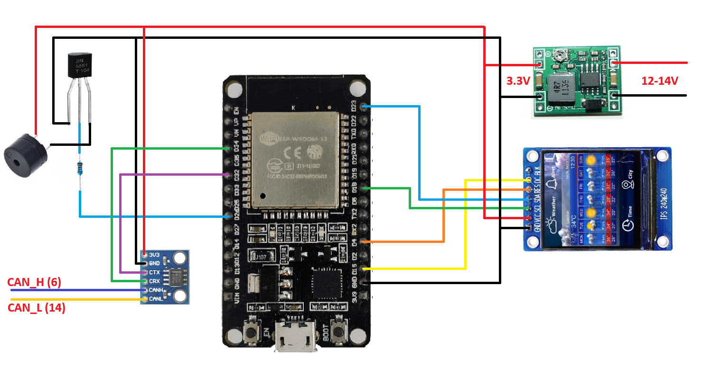
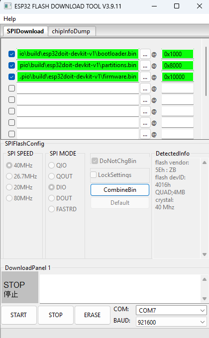

# Infiniti QX50 J55 Monitoring

Бортовой монитор на ESP32 с TFT-дисплеем и веб-интерфейсом настройки.
Считывает параметры автомобиля через диагностический протокол UDS (ISO 14229) по шине CAN (OBD-II).
При выходе параметров за пределы нормы — воспроизводит звуковой сигнал через бузер и показывает оверлей на дисплее.

В версии прошивки XXXX.Y.Z каждое число означает следующее:
1. XXXX — год выпуска релиза прошивки.
2. Y — мажорная версия (Major). Указывает на крупные изменения, новые функции или глобальное обновление архитектуры.
3. Z — минорная версия (Minor). Указывает на мелкие доработки, исправления ошибок или добавление небольших возможностей в рамках текущего мажора.

---

## Поддерживаемые платформы

| Платформа | Дисплей | Окружение сборки |
|-----------|---------|-----------------|
| **ESP32 DEVKIT1** | ST7789 240×240 SPI | `esp32`, `esp32-mock` |
| **WT32-SC01 Plus ESP32-S3** | ST7796 320×480 8-бит параллельный | `esp32s3-wt32`, `esp32s3-wt32-mock` |

---

## Необходимое оборудование

### Вариант A: ESP32 DEVKIT1

| Компонент | Описание |
|-----------|----------|
| **ESP32 DEVKIT1** | Основной микроконтроллер. Любая плата на базе ESP32 с 30 или 38 пинами (DEVKIT V1 / DOIT). |
| **IPS TFT ST7789** | Дисплей 240×240 пикселей, интерфейс SPI, питание 3.3 В. |
| **WVCMCU-230** | CAN-трансивер на базе SN65HVD230, питание 3.3 В, подключается к OBD-II разъёму автомобиля. |
| **Пассивный бузер** | Пьезоизлучатель для звукового оповещения об алертах. Подключается к GPIO 26 через резистор 1кОм и 2N5551. |
| **DC-DC** | Преобразователь напряжения 12–24 В в 5 В. |
| **Провода** | Соединительные провода (желательно разных цветов для удобства монтажа). |
| **Паяльник + припой** | Для надёжного соединения проводов с платами. |

### Вариант B: WT32-SC01 Plus ESP32-S3

| Компонент | Описание |
|-----------|----------|
| **WT32-SC01 Plus** | Плата с встроенным дисплеем ST7796 320×480 и ESP32-S3-WROVER-N16R2 (16 МБ Flash, 2 МБ PSRAM). |
| **WVCMCU-230** | CAN-трансивер на базе SN65HVD230, питание 3.3 В, подключается к OBD-II разъёму автомобиля. |
| **Пассивный бузер** | Пьезоизлучатель для звукового оповещения об алертах. Подключается к GPIO 26 через резистор 1кОм и 2N5551. |
| **DC-DC** | Преобразователь напряжения 12–24 В в 5 В. |
| **Провода** | Соединительные провода (желательно разных цветов для удобства монтажа). |
| **Паяльник + припой** | Для надёжного соединения проводов с платами. |

> Дисплей встроен в плату WT32-SC01 Plus и не требует отдельного подключения.

---

## 1. Подключение оборудования

### TFT-дисплей (ST7789, 240×240) — только для ESP32 DEVKIT1

| Дисплей | ESP32 GPIO | Описание |
|---------|-----------|----------|
| SDA / MOSI | GPIO **23** | Данные SPI |
| SCL / SCLK | GPIO **18** | Тактирование SPI |
| RES / RST  | GPIO **4**  | Сброс дисплея |
| DC / RS    | GPIO **15** | Данные / команда |
| CS         | —           | Не подключать (CS=-1, дисплей всегда выбран) |
| VCC        | **3.3 В**   | Питание |
| GND        | **GND**     | Земля |

> Дисплей работает на 3.3 В. Не подключайте к 5 В — это выведет его из строя.

---

### CAN-модуль WVCMCU-230 (SN65HVD230) — для обеих платформ

| Модуль | GPIO | Описание |
|--------|------|----------|
| CTX    | GPIO **32** | CAN TX (МК → трансивер) |
| CRX    | GPIO **34** | CAN RX (трансивер → МК) — только вход |
| VCC    | **3.3 В**  | Питание |
| GND    | **GND**    | Земля |
| CANH   | OBD-II пин **6** | Шина CAN High |
| CANL   | OBD-II пин **14** | Шина CAN Low |

> На WT32-SC01 Plus GPIO 32 и GPIO 34 доступны на разъёме расширения.

> ESP32 активно опрашивает блоки управления двигателем (ECM) и трансмиссией (TCM) по протоколу UDS, отправляя запросы `ReadDataByIdentifier` (сервис 0x22). Это безопасно: запросы стандартны, используются штатным дилерским оборудованием.

> Скорость шины: **500 кбит/с** (стандарт для большинства автомобилей, в т.ч. Infiniti QX50 J55).

---

### Пассивный бузер — для обеих платформ

| Бузер | GPIO | Описание |
|-------|------|----------|
| + / S  | GPIO **26** | Сигнальный вывод |
| − / GND | **GND**    | Земля |

При включении устройства бузер воспроизводит короткую мелодию приветствия (в стиле BIOS POST). При срабатывании алерта — сигнал оповещения.

> На WT32-SC01 Plus GPIO 26 доступен на разъёме расширения.



---

## 2. Установка драйверов

### Для ESP32 DEVKIT1 — установка USB-UART драйвера

### 2.1 CP2102

ESP32 подключается к компьютеру через USB-UART мост CP2102. Без драйвера Windows не увидит устройство.

1. Скачайте драйвер: https://myrobot.ru/downloads/driver-cp2102-esp32.php
2. Разархивируйте в любую папку.
3. Откройте **Диспетчер устройств**: `Win + R` → введите `devmgmt.msc` → Enter.
4. Подключите ESP32 к компьютеру по USB.
5. В диспетчере найдите устройство **CP2102 USB to UART Bridge** (обычно в разделе «Другие устройства» или «Порты COM и LPT»).
6. Нажмите правой кнопкой → **Обновить драйвер** → **Поиск драйверов на этом компьютере**.
7. Укажите папку, в которую разархивировали драйвер.
8. После установки в диспетчере появится **Silicon Labs CP210x USB to UART Bridge (COMx)** — запомните номер порта.

### 2.2 CH340 / CH9102

1. Скачайте установщик **CH340** https://wiki.amperka.ru/_media/articles:driver-ch340:ch340ser-windows.zip, для **CH9102** https://myrobot.ru/downloads/programs/driver_ch9102x_win.zip
2. Распакуйте скачанный архив, запустите `.exe` файл приложения и нажмите в открывшемся окне одну кнопку — `Install` («Установить»). Система сама всё настроит.
3. Нажмите комбинацию клавиш `Win + R`, введите команду `devmgmt.msc` и нажмите `Enter`.
4. Подключите ESP32 по USB.
5. В диспетчере мгновенно раскроется или обновится вкладка «Порты (COM и LPT)». Если у вас чип CH340, там появится строка **USB-SERIAL CH340 (COMx)**. Если чип CH9102, то отобразится **CH343 USB Serial Converter (COMx)** или аналогичное название порта.

---

## 3. Прошивка через ESP32 Flash Download Tool

Используйте этот способ, если не хотите устанавливать PlatformIO / VS Code — достаточно скачать один инструмент.

### 3.1 Подготовка файлов прошивки

Скачайте последнюю версию релиза с GitHub. В архиве должны быть следующие файлы: `bootloader.bin`, `partitions.bin`, `firmware.bin`.

### 3.2 Скачать Flash Download Tool

1. Перейдите на сайт Espressif: https://docs.espressif.com/projects/esp-test-tools/en/latest/esp32/production_stage/tools/flash_download_tool.html
2. Скачайте **Flash Download Tools**.
3. Разархивируйте в любую папку и запустите `flash_download_tool_x.x.x.exe`.

### 3.3 Настройка инструмента

1. В открывшемся окне выберите:
   - **ChipType:** `ESP32`
   - **WorkMode:** `Develop`
   - Нажмите **OK**.

2. В главном окне добавьте три строки (кнопка **...** для выбора файла):

   | ✓ | Путь к файлу | @ | Адрес |
   |---|-------------|---|-------|
   | ☑ | `bootloader.bin` | @ | `0x1000` |
   | ☑ | `partitions.bin` | @ | `0x8000` |
   | ☑ | `firmware.bin`   | @ | `0x10000` |

3. Настройте параметры внизу окна:

   | Параметр | Значение |
   |----------|---------|
   | SPI SPEED | `40 MHz` |
   | SPI MODE  | `DIO` |
   | COM       | Ваш порт (например `COM3`) |
   | BAUD      | `921600` |

### 3.4 Прошивка

1. Подключите ESP32 к компьютеру по USB.
2. Нажмите кнопку **ERASE** — дождитесь надписи `FINISH` (очистка памяти).
3. Нажмите кнопку **START** — начнётся прошивка, прогресс-бар покажет ход загрузки.
4. После надписи `FINISH` нажмите кнопку **EN** (Reset) на плате ESP32 или переподключите USB.

> Если прошивка не начинается — зажмите кнопку **BOOT** на плате, нажмите **START**, затем отпустите **BOOT**.

**Пример настроенного окна Flash Download Tool:**



---

## 4. Мониторинг через Yet Another Terminal (YAT). Необязательный шаг

YAT — удобный терминал для просмотра отладочного вывода ESP32 через UART (USB-кабель). Поддерживает кириллицу и кодировку UTF-8, что удобно при работе с русскоязычным выводом.

### 4.1 Установка

1. Скачайте YAT: https://sourceforge.net/projects/y-a-terminal/
2. Установите через инсталлятор или используйте portable-версию.

### 4.2 Настройка подключения

1. Запустите YAT.
2. В меню **File** → **New Terminal** (или при первом запуске откроется мастер настройки).
3. Установите параметры:

   | Параметр | Значение |
   |----------|---------|
   | Port | Ваш порт (например `COM3`) |
   | Baud rate | `115200` |
   | Data bits | `8` |
   | Stop bits | `1` |
   | Parity | `None` |
   | Flow control | `None` |

4. Нажмите **OK** / **Open**.

### 4.3 Просмотр вывода

1. Подключите ESP32 к компьютеру по USB.
2. Нажмите кнопку **EN** (Reset) на плате или переподключите USB — в окне YAT появится лог загрузки.
3. В процессе работы устройство выводит отладочную информацию: состояние CAN-шины, принятые UDS-ответы, значения датчиков, срабатывание алертов.

> Если в окне нет вывода — проверьте правильность порта COM и скорость 115200. Порт должен совпадать с тем, что отображается в Диспетчере устройств (**Silicon Labs CP210x**).

> **Предупреждения при старте — это нормально.** При каждом включении ESP32 ROM-загрузчик выводит несколько служебных строк на скорости 74880 бод (не 115200), поэтому YAT видит их как мусор: `RX FRAMING ERROR`, `invalid UTF-8 byte sequence`, `No core dump partition found`. Эти сообщения не относятся к нашему коду и не влияют на работу устройства — просто игнорируйте их.

---

## 5. Подключение к WiFi и веб-интерфейс

ESP32 создаёт собственную точку доступа (Access Point) — интернет не нужен.

| Параметр | Значение по умолчанию |
|----------|-----------------------|
| Сеть     | `QX50Monitoring`      |
| Пароль   | `infiniti`            |
| Адрес    | http://192.168.4.1    |

> Имя сети и пароль можно изменить через веб-интерфейс (раздел **«⚙ 1. Системные параметры»**). После сохранения устройство перезагрузится с новыми настройками.

**Шаги:**

1. На телефоне или ноутбуке откройте список WiFi-сетей.
2. Подключитесь к сети **QX50Monitoring**, пароль `infiniti`.
3. Откройте браузер и перейдите по адресу **http://192.168.4.1**.
4. Откроется страница редактора конфигурации.
5. Можно забыть WiFi-сеть, чтобы телефон не подключался автоматически.

> Если браузер автоматически переключается на мобильный интернет — отключите передачу данных или разрешите использование сети без интернета.

### HTTP API

| Метод | Путь | Описание |
|-------|------|---------|
| `GET`  | `/`               | Главная страница (HTML) — редактор конфигурации |
| `GET`  | `/live`           | Страница онлайн мониторинга (HTML) — метрики в реальном времени |
| `GET`  | `/metrics`        | Текущие значения метрик и их состояния (JSON) |
| `GET`  | `/config`         | Текущий конфиг порогов (JSON) |
| `POST` | `/config`         | Сохранить конфиг порогов (JSON body) |
| `POST` | `/reset`          | Сбросить конфиг порогов к заводским значениям |
| `GET`  | `/wifi`           | Текущие WiFi-настройки (JSON: ssid, password) |
| `POST` | `/wifi`           | Сохранить WiFi-настройки (JSON body) |
| `POST` | `/restart`        | Перезагрузить устройство |
| `GET`  | `/alerts`         | Журнал сработавших алертов (JSON) |
| `POST` | `/alerts-clear`   | Очистить журнал алертов |
| `GET`  | `/checks`         | Конфиг проверок алертов (JSON) |
| `POST` | `/checks`         | Сохранить конфиг проверок (JSON body) |
| `GET`  | `/update`         | Страница OTA-обновления прошивки (редирект на `/`) |
| `POST` | `/update`         | Загрузить `.bin` файл прошивки (multipart) |

### Онлайн мониторинг (веб)

Страница **http://192.168.4.1/live** (ссылка **«📊 Онлайн мониторинг →»** на главной)
показывает все метрики в реальном времени прямо в браузере — удобно, когда дисплей не виден.

- **Сетка метрик** — 9 карточек по 3 в ряд, в том же порядке, что и на дисплее:
  RAD-ANT · ENG-ANT · ENG-OIL / ENG-RPM · OIL-PR-V · TURBO-V / BATTERY-V · RPM-POLL · CVT-FLD.
  Значения обновляются каждые **0.5 сек** (опрос `/metrics`), цвет левой полосы и числа
  отражает состояние (синий / зелёный / жёлтый / красный / серый «нет данных»).
- **Индикатор связи** — строка «В сети · обновлено ЧЧ:ММ:СС · аптайм …» либо «Нет связи с устройством».
- **Баннер ошибок** — красная плашка «⚠ Зафиксированы ошибки…» появляется, если в журнале
  есть срабатывания, и исчезает после его очистки.
- **История срабатываний** — та же таблица журнала алертов, что и на главной, с кнопкой
  **«🗑 Очистить историю»**. Обновляется каждые **5 сек** и сразу после очистки.

---

## 6. OTA — обновление прошивки по воздуху

После первой прошивки через USB все последующие обновления можно загружать **без кабеля** прямо через браузер.

### Что нужно

- Файл `firmware.bin` новой версии (из релиза или собранный PlatformIO: `.pio/build/esp32/firmware.bin`).
- Подключение к точке доступа **QX50Monitoring**.

### Порядок обновления

1. Подключитесь к WiFi-сети **QX50Monitoring** (пароль `infiniti`).
2. Откройте **http://192.168.4.1** в браузере.
3. Прокрутите страницу вниз до раздела **«↑ OTA — Обновление прошивки»**.
4. Нажмите **«Выбрать .bin»** и укажите файл `firmware.bin`.
5. Нажмите **«↑ Загрузить»** и подтвердите в диалоге.
6. Дождитесь заполнения прогресс-бара и сообщения **«✓ Прошивка записана. Перезагрузка...»**.
7. ESP32 автоматически перезагрузится с новой прошивкой (~2–3 секунды).

> **Страница перестанет отвечать** на время перезагрузки — это нормально. Через 5–10 секунд обновите страницу браузера.

> **Первичная прошивка через USB обязательна.** OTA-обновления возможны только после того, как устройство хотя бы один раз прошито через USB Flash Download Tool или PlatformIO.

### Как устроено OTA (техническая справка)

Флеш-память ESP32 (4 МБ) разделена на два одинаковых слота прошивки:

| Раздел | Тип | Смещение | Размер | Назначение |
|--------|-----|----------|--------|-----------|
| `nvs`     | data/nvs | `0x9000`  | 20 KB  | Энергонезависимое хранилище |
| `otadata` | data/ota | `0xE000`  | 8 KB   | Указывает, какой слот загрузить |
| `ota_0`   | app/ota_0 | `0x10000` | 1.75 MB | Слот A |
| `ota_1`   | app/ota_1 | `0x1D0000` | 1.75 MB | Слот B |
| `spiffs`  | data/spiffs | `0x390000` | 448 KB | LittleFS (конфиг и журналы) |

При OTA-обновлении:
1. Новая прошивка записывается в **неактивный** слот.
2. `otadata` обновляется, указывая на новый слот.
3. ESP32 перезагружается и загружается из нового слота.

Старая прошивка остаётся в предыдущем слоте до следующего OTA-обновления.

### Файлы LittleFS

В разделе `spiffs` (LittleFS, 448 КБ) хранятся три файла:

| Файл | Описание |
|------|---------|
| `/config.json` | Пороги отображения метрик (цветовые зоны) |
| `/checks.json` | Конфиг проверок алертов (включены/отключены + пороги) |
| `/alerts.json` | Журнал сработавших алертов (сохраняется между перезагрузками) |

---

## 7. Метрики на дисплее

Дисплей 240×240 разделён на три секции. Цвет каждого значения меняется плавно согласно настроенным порогам.

При срабатывании алерта дисплей переходит в **режим оверлея** — метрики скрываются и на весь экран отображается код и описание алерта (например, `E01 — Engine oil temperature exceeded maximum threshold`). Оверлей исчезает автоматически через **5 секунд**.

### TEMPERATURE — температурные датчики

| Метка | Описание | Единица |
|-------|----------|---------|
| **RAD-ANT** | Температура антифриза в радиаторе | °C |
| **ENG-ANT** | Температура антифриза ДВС | °C |
| **ENG-OIL** | Температура моторного масла ДВС | °C |

Цвет меняется по схеме **синий → зелёный → красный** (холодно → норма → перегрев).

### ENGINE — параметры двигателя

| Метка | Описание | Единица |
|-------|----------|---------|
| **ENG-RPM** | Обороты двигателя | об/мин |
| **OIL-PR-V** | Напряжение датчика давления масла ДВС | В |
| **TURBO-V** | Напряжение датчика давления наддува (турбина) | В |

### OTHER — прочие параметры

| Метка | Описание | Единица |
|-------|----------|---------|
| **BATTERY-V** | Напряжение бортовой сети | В |
| **RPM-POLL** | Время ответа ECU на UDS-запрос оборотов | с |
| **CVT-FLD** | Температура масла вариатора (CVT) | °C |

### Цветовая индикация

| Цвет | Значение |
|------|----------|
| 🔵 Синий | Нет данных или агрегат не прогрет или не готов к работе |
| 🟢 Зелёный | Рабочий / нормальный диапазон |
| 🟡 Жёлтый | Переходная зона (плавный градиент) |
| 🔴 Красный | Выход за пределы нормы / перегрев |

---

## 8. Настройка порогов

Все пороги хранятся в файловой системе LittleFS (`/config.json`) и доступны для редактирования через веб-интерфейс.

Каждая карточка содержит кнопку **«↺ Сброс»** — сбрасывает поля только этой карточки к заводским значениям без сохранения. Кнопка **«↺ По умолчанию»** в разделе «Конфигурация метрик» сбрасывает весь конфиг и немедленно сохраняет его.

> При изменении значений по умолчанию в прошивке (новая версия) конфиг автоматически сбрасывается — это определяется по CRC32 хешу блока defaults.

### 🌡️ Температурные датчики

Три порога: минимум (не прогрет), цель (рабочая температура), максимум (перегрев).

| Секция | Датчик | Мин, °C | Цель, °C | Макс, °C |
|--------|--------|---------|----------|---------|
| `oil` | ENG-OIL — моторное масло ДВС | 50 | 90 | 98 |
| `coolant` | ENG-ANT — антифриз ДВС | 50 | 90 | 93 |
| `radiator` | RAD-ANT — антифриз радиатора | 0 | 50 | 90 |
| `transmission` | CVT-FLD — масло вариатора | 50 | 80 | 98 |

### ⚙️ Обороты двигателя (ENG-RPM)

Секция `rpm` — три порога цветовых зон:

| Параметр | Знач. по умолч. | Описание |
|----------|----------------|---------|
| `green_start` | 1000 об/мин | Начало зелёной зоны |
| `green_end`   | 3500 об/мин | Конец зелёной зоны |
| `red_start`   | 4500 об/мин | Начало красной зоны |

Ниже `green_start` — синий, выше `red_start` — красный, между зонами — плавный переход через жёлтый.

### 🛢️ Давление масла ДВС (OIL-PR-V)

Секция `oil_pressure` — минимально допустимое значение зависит от оборотов:

| Параметр | Знач. по умолч. | Описание |
|----------|----------------|---------|
| `rpm_threshold` | 3000 об/мин | Граница низких / высоких оборотов |
| `min_low`       | 1.45 В | Минимум при RPM < threshold (красный ниже) |
| `min_high`      | 3.1 В  | Минимум при RPM ≥ threshold (красный ниже) |

### 💨 Наддув (TURBO-V)

Секция `boost` — цветовые пороги напряжения датчика MAP:

| Параметр | Знач. по умолч. | Описание |
|----------|----------------|---------|
| `blue_max`  | 1.30 В | ≤ этого — синий (нет давления) |
| `green_min` | 1.58 В | ≥ этого — зелёный (наддув есть) |

Между порогами — плавный переход синий → жёлтый → зелёный.

### 🔋 Бортовая сеть (BATTERY-V)

Секция `battery` — пороги напряжения в Вольтах:

| Параметр | Знач. по умолч. | Описание |
|----------|----------------|---------|
| `red_low`   | 11.5 В | Ниже — красный (разряд) |
| `green_min` | 12.0 В | Начало зелёной зоны |
| `green_max` | 14.6 В | Конец зелёной зоны |
| `red_high`  | 14.9 В | Выше — красный (перезаряд) |

### ⏱️ Время опроса ECU (RPM-POLL)

Секция `poll_time` — время ответа ECU на UDS-запрос оборотов (секунды):

| Параметр | Знач. по умолч. | Описание |
|----------|----------------|---------|
| `green_max` | 0.20 с | ≤ этого — зелёный (нормальный отклик) |
| `red_min`   | 0.50 с | ≥ этого — красный (ECU медленно отвечает) |

### 🔧 Системные параметры UDS-опроса

Секция `system` — управляет планировщиком запросов:

| Параметр | Знач. по умолч. | Описание |
|----------|----------------|---------|
| `poll_interval_ms` | 30 мс  | Пауза между последовательными UDS-запросами |
| `stale_ms`         | 1000 мс | Через сколько мс без ответа значение обнуляется |

### 📶 WiFi точка доступа

Секция `wifi` — настройки AP (изменяются в разделе «⚙ 1. Системные параметры»):

| Параметр | Знач. по умолч. | Описание |
|----------|----------------|---------|
| `ssid`     | `QX50Monitoring` | Имя WiFi-сети |
| `password` | `infiniti`       | Пароль WiFi-сети |

---

## 9. Система алертов

Устройство непрерывно отслеживает параметры и при выходе за пределы нормы:

1. Воспроизводит **звуковой сигнал** через бузер (GPIO 26).
2. Показывает **оверлей на дисплее** с кодом и описанием (5 секунд).
3. Записывает событие в **журнал алертов** (`/alerts.json`), который сохраняется между перезагрузками.

Каждая проверка имеет два режима, которые переключаются toggle-переключателем в Web UI:

| Режим | Поведение |
|-------|----------|
| **При постоянной ошибке повтор раз в 15 сек** (toggle вкл) | Пока условие нарушено — сигнал и оверлей повторяются каждые 15 секунд |
| **Однократно за сессию** (toggle выкл) | Сигнал срабатывает только один раз с момента включения устройства; сбрасывается только перезагрузкой |

### Коды алертов

| Код | Название | Описание | Параметры по умолч. |
|-----|---------|---------|-------------------|
| **E01** | Engine Oil Temp High | Температура масла ДВС превысила максимум | Max: 98 °C |
| **E02** | Engine Coolant Temp High | Температура ОЖ ДВС превысила максимум | Max: 96 °C |
| **E03** | Radiator Coolant Temp High | Температура ОЖ радиатора превысила максимум | Max: 90 °C |
| **E04** | CVT Oil Temp High | Температура масла вариатора превысила максимум | Max: 100 °C |
| **E05** | Engine RPM Overspeed | Обороты двигателя превысили максимум | Max: 6500 об/мин |
| **E06** | Battery Voltage Low | Напряжение бортовой сети упало ниже минимума | Min: 11.5 В |
| **E07** | Battery Voltage High | Напряжение бортовой сети превысило максимум | Max: 15.0 В |
| **E08** | Oil Pressure Low | Напряжение датчика давления масла ниже нормы для текущих оборотов | RPM порог: 3000, Min low: 1.4 В, Min high: 2.9 В |
| **E09** | Oil-Coolant Temp Delta High | Разница температур масла и антифриза ДВС превысила порог | Max дельта: 14 °C |

### Управление алертами через веб-интерфейс

На главной странице `http://192.168.4.1` доступны два раздела:

**Журнал алертов** — список всех сработавших проверок с количеством срабатываний.
Кнопка **«Очистить журнал»** удаляет все записи и файл `/alerts.json`.

**Настройка проверок** — для каждой проверки (E01–E09) можно:
- Переключить режим срабатывания (toggle): **«При постоянной ошибке повтор раз в 15 сек»** или **«Однократно за сессию»**.
- Изменить пороговые значения (одно или несколько в зависимости от проверки).
- Нажать **«↺ Сброс»** на карточке, чтобы восстановить заводские параметры только этой проверки.

Изменения сохраняются в `/checks.json` и применяются немедленно без перезагрузки.

---

## 10. UDS-опрос (техническая справка)

Устройство активно опрашивает два блока управления автомобиля по протоколу **UDS (ISO 14229)** через шину CAN.

| Блок | CAN ID | Описание |
|------|--------|---------|
| ECM  | `0x7E0` | Блок управления двигателем |
| TCM  | `0x7E1` | Блок управления трансмиссией (вариатором) |

### Список опрашиваемых параметров

| Блок | DID | Описание |
|------|-----|---------|
| ECM | `0x1201` | Обороты двигателя |
| ECM | `0x110E` | Давление наддува (турбина) |
| ECM | `0x1278` | Давление масла ДВС |
| ECM | `0x1103` | Напряжение бортовой сети |
| ECM | `0x1101` | Температура антифриза ДВС |
| ECM | `0x111F` | Температура моторного масла ДВС |
| ECM | `0x116B` | Температура антифриза радиатора |
| TCM | `0x110C` | Температура масла вариатора |

### Порядок работы планировщика

1. При старте — открывается расширенная диагностическая сессия (`0x10 0xC0`) на обоих блоках.
2. Каждые **30 мс** (настраивается) по кругу отправляется один `ReadDataByIdentifier` запрос (сервис `0x22`).
3. Каждые **2 секунды** — отправляется `Tester Present` (`0x3E 0x80`, без запроса ответа) на оба блока для удержания сессии.
4. При отсутствии ответа более **1 секунды** (настраивается) значение обнуляется на дисплее.

---

## 11. Сборка из исходников (PlatformIO)

Проект собирается с помощью [PlatformIO](https://platformio.org/) в VS Code.

### Окружения сборки

| Окружение | Платформа | Данные | Команда сборки |
|-----------|-----------|--------|---------------|
| `esp32` | ESP32 DEVKIT1, ST7789 | Реальный CAN | `pio run -e esp32` |
| `esp32-mock` | ESP32 DEVKIT1, ST7789 | Имитация | `pio run -e esp32-mock` |
| `esp32s3-wt32` | WT32-SC01 Plus, ST7796 | Реальный CAN | `pio run -e esp32s3-wt32` |
| `esp32s3-wt32-mock` | WT32-SC01 Plus, ST7796 | Имитация | `pio run -e esp32s3-wt32-mock` |

### Прошивка ESP32 DEVKIT1

```
pio run -e esp32 --target upload
```

Готовый бинарник для OTA или Flash Tool:
```
.pio/build/esp32/firmware.bin
```

### Прошивка WT32-SC01 Plus (ESP32-S3)

WT32-SC01 Plus **не имеет отдельного USB-UART чипа** (CP210x / CH340). Прошивка выполняется
через встроенный USB Serial/JTAG интерфейс ESP32-S3.

**Первая прошивка — вход в режим загрузки вручную:**

1. Подключите плату к компьютеру по USB-C.
2. Зажмите кнопку **BOOT** на плате.
3. Нажмите и отпустите кнопку **RESET**.
4. Отпустите **BOOT** — плата перейдёт в режим загрузки.
5. Выполните команду:

```
pio run -e esp32s3-wt32 --target upload
```

**Последующие прошивки** через OTA работают стандартно — кнопки не нужны.

Готовый бинарник:
```
.pio/build/esp32s3-wt32/firmware.bin
```

## 12. Лицензия

Проект распространяется под лицензией **PolyForm Noncommercial License 1.0.0**.

### ✅ Разрешено

- Использовать в личных, некоммерческих целях
- Модифицировать при сохранении текста лицензии
- Распространять в некоммерческих целях

### ❌ Строго запрещено

- Использовать этот код в коммерческих устройствах (для продажи)
- Продавать платы или устройства с прошитым данным кодом
- Использовать код для оказания платных услуг

Полный текст лицензии — в файле [`LICENSE`](LICENSE).