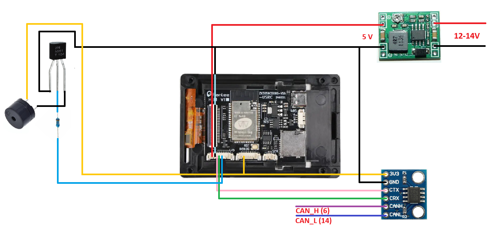

# Сборка, подключение и первоначальная настройка

Это руководство предназначено для самостоятельной сборки устройства и разработки прошивки.
Обычному пользователю готового и установленного монитора эти действия не нужны.

## Поддерживаемые варианты

| Плата | Дисплей | Окружения PlatformIO |
|-------|---------|----------------------|
| ESP32 DEVKIT1 | ST7789 240×240, SPI | `esp32`, `esp32-mock` |
| WT32-SC01 Plus ESP32-S3 | ST7796 320×480, параллельный 8-битный интерфейс | `esp32s3-wt32`, `esp32s3-wt32-mock` |

Окружения с суффиксом `-mock` имитируют данные и подходят для проверки устройства без автомобиля.

## Комплектующие

Для варианта на ESP32 DEVKIT1 нужны плата ESP32, дисплей ST7789 240×240, CAN-трансивер
WVCMCU-230 на SN65HVD230, пассивный бузер, преобразователь 12–24 В в 5 В и провода.

Для варианта на WT32-SC01 Plus отдельный дисплей не нужен. Дополнительно потребуются тот же
CAN-трансивер, пассивный бузер, преобразователь питания и провода.

Корпус можно напечатать на 3D-принтере:

- [первая версия корпуса](../stl/full_v1.stl)
- изменённая версия: [корпус микроконтроллера](../stl/mc_housing_v2) и
  [корпус дисплея](../stl/display_housing_v2)

## Подключение

### Дисплей ST7789 для ESP32 DEVKIT1

| Вывод дисплея | Подключение |
|---------------|------------|
| SDA / MOSI | GPIO 23 |
| SCL / SCLK | GPIO 18 |
| RES / RST | GPIO 4 |
| DC / RS | GPIO 15 |
| BLK | GPIO 27 через резистор 500 Ом, если вывод есть |
| CS | не подключать |
| VCC | 3,3 В |
| GND | GND |

Дисплей рассчитан на 3,3 В. Подключение к 5 В может вывести его из строя.

Вывод BLK необязателен: дисплеи без него работают с той же прошивкой, но изменение яркости в
веб-интерфейсе на них не действует. Для дисплея с BLK яркость задается от 10 до 100% в разделе
«Системные параметры». Если по документации конкретного модуля BLK является прямым выводом питания
светодиодов, а не управляющим входом, подключайте его через транзистор или MOSFET.

### Питание WT32-SC01 Plus

Преобразователь DC-DC понижает бортовое напряжение 12–14 В до 5 В. Его выход подключается к разъему
`EXT_IO_1`: `+5 В` — к контакту 1, `GND` — к контакту 2. Контакты считаются слева направо, если
смотреть на плату так же, как на схеме ниже.

Питание 3,3 В для WVCMCU-230 и цепи пассивного бузера берется с контакта 2 разъема `EXT_IO_2`,
второго слева. Земля CAN-трансивера и бузера подключается непосредственно к `GND` выхода DC-DC;
она является общей с землей платы.

### CAN-трансивер для обеих платформ

| Вывод WVCMCU-230 | ESP32 DEVKIT1 | WT32-SC01 Plus |
|------------------|----------------|----------------|
| CTX | GPIO 32 | GPIO 10, `EXT_IO_1` контакт 3 слева |
| CRX | GPIO 34 | GPIO 11, `EXT_IO_1` контакт 4 слева |
| VCC | 3,3 В | 3,3 В, `EXT_IO_2` контакт 2 слева |
| GND | GND | `GND` выхода DC-DC |
| CANH | контакт 6 OBD-II | контакт 6 OBD-II |
| CANL | контакт 14 OBD-II | контакт 14 OBD-II |

Скорость CAN — 500 кбит/с. На WT32-SC01 Plus GPIO 10 и GPIO 11 доступны на разъеме `EXT_IO_1` и
не конфликтуют со встроенным дисплеем и сенсорной панелью.

### Пассивный бузер

На ESP32 DEVKIT1 управляющий сигнал подключается к GPIO 26. На WT32-SC01 Plus он подключается к
GPIO 12, то есть к контакту 5 слева разъема `EXT_IO_1`. Питание 3,3 В берется с контакта 2 слева
разъема `EXT_IO_2`, а земля — с `GND` выхода DC-DC. Для схемы с транзистором 2N5551 используется
резистор 1 кОм.

На WT32-SC01 Plus есть встроенный I2S-усилитель и выход `SPK+/SPK-`, но самого динамика на плате нет.
Текущая прошивка этот выход не использует: звуковые сигналы воспроизводятся внешним пассивным
бузером на GPIO 12.




## Первичная прошивка ESP32 DEVKIT1 из WSL

Плата может использовать USB-UART преобразователь CP2102, CH340 или CH9102. Передайте USB-устройство
в WSL и проверьте, что появился порт `/dev/ttyUSB0` либо `/dev/ttyACM0`:

```bash
ls -l /dev/ttyUSB* /dev/ttyACM* 2>/dev/null
```

Для прошивки без PlatformIO установите `esptool`. В релизе потребуются `bootloader.bin`,
`partitions.bin` и `firmware.bin`.

| Файл | Адрес |
|------|-------|
| `bootloader.bin` | `0x1000` |
| `partitions.bin` | `0x8000` |
| `firmware.bin` | `0x10000` |

Команды прошивки выполняет только владелец устройства:

```bash
python3 -m esptool --chip esp32 --port /dev/ttyUSB0 --baud 921600 erase_flash
python3 -m esptool --chip esp32 --port /dev/ttyUSB0 --baud 921600 \
  write_flash --flash_mode dio --flash_freq 40m \
  0x1000 bootloader.bin 0x8000 partitions.bin 0x10000 firmware.bin
```

После завершения перезапустите плату кнопкой `EN`. Если запись не начинается, удерживайте
`BOOT` при запуске команды и отпустите ее после начала соединения.

## Первичная прошивка WT32-SC01 Plus из WSL

Для WT32-SC01 Plus в релизе используются отдельные файлы с постфиксом `_s3`. Не прошивайте в
WT32 загрузчик `bootloader.bin` от ESP32 DEVKIT1.

| Файл | Адрес |
|------|-------|
| `bootloader_s3.bin` | `0x0000` |
| `partitions_s3.bin` | `0x8000` |
| `firmware_s3.bin` | `0x10000` |

Для входа в режим загрузки подключите плату по USB-C, зажмите `BOOT`, нажмите и отпустите `RESET`,
затем отпустите `BOOT`. Обычно встроенный USB Serial/JTAG появляется как `/dev/ttyACM0`.
Команды прошивки выполняет только владелец устройства:

```bash
python3 -m esptool --chip esp32s3 --port /dev/ttyACM0 --baud 460800 erase_flash
python3 -m esptool --chip esp32s3 --port /dev/ttyACM0 --baud 460800 \
  write_flash --flash_mode qio --flash_freq 80m --flash_size 16MB \
  0x0000 bootloader_s3.bin 0x8000 partitions_s3.bin 0x10000 firmware_s3.bin
```

По завершении нажмите `RESET` или переподключите USB-C.

## Сборка из исходников

Проект собирается с помощью [PlatformIO](https://platformio.org/). Установите PlatformIO Core и
убедитесь, что команда `platformio` доступна в WSL `PATH`.

```bash
platformio run
platformio run -e esp32
platformio run -e esp32s3-wt32
```

Для записи ESP32 DEVKIT1:

```bash
platformio run -e esp32 -t upload
```

Для первой записи WT32-SC01 Plus подключите USB-C, удерживайте `BOOT`, нажмите и отпустите
`RESET`, затем отпустите `BOOT` и выполните:

```bash
platformio run -e esp32s3-wt32 -t upload
```

Готовые OTA-образы находятся в `.pio/build/<окружение>/firmware.bin`.

## Юнит-тесты

Хостовые тесты не требуют платы или Xtensa toolchain. Из корня проекта выполните:

```bash
./run-tests.sh
./run-tests.sh -f test_ota_image
```

Либо вызовите PlatformIO напрямую:

```bash
platformio test -e native
```

## Обновление готового устройства

После первичной прошивки обновления устанавливаются без кабеля. Подключитесь к сети
`QX50Monitoring`, откройте [http://192.168.4.1](http://192.168.4.1), перейдите к разделу
обновления и загрузите совместимый `firmware.bin`. Не отключайте питание до завершения записи и
автоматической перезагрузки.

Подробности об OTA-слотах, формате прошивки и работе системы приведены в
[технических нюансах](technical-details.md).
